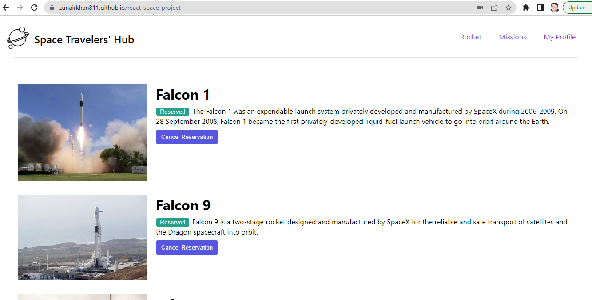
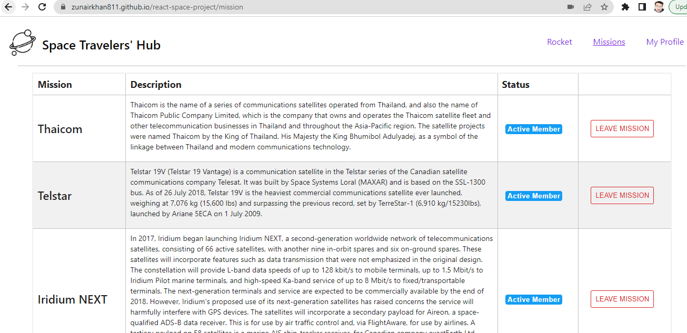
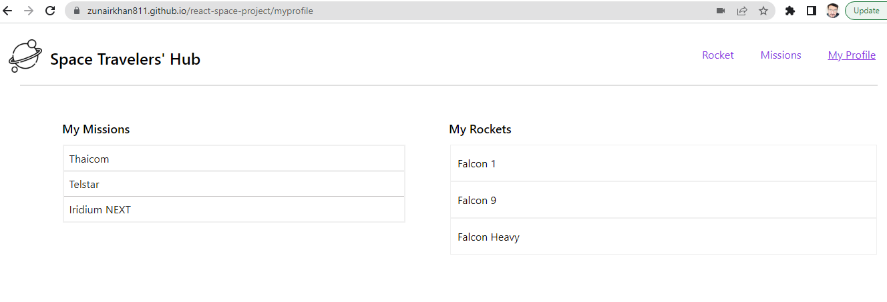

<a name="readme-top"></a>

<div align="center">

  <h3><b>React Space Project</b></h3>
  
  
  

</div>

<!-- TABLE OF CONTENTS -->

# 📗 Table of Contents

- [📗 Table of Contents](#-table-of-contents)
- [📖 React Space Project ](#-react-space-project-)
  - [:hammer\_and\_wrench: Built With ](#hammer_and_wrench-built-with-)
    - [Tech Stack ](#tech-stack-)
  - [Key Features ](#key-features-)
  - [💻 Getting Started ](#-getting-started-)
    - [Prerequisites](#prerequisites)
    - [Setup](#setup)
    - [Install](#install)
    - [Usage](#usage)
    - [Run tests](#run-tests)
    - [Deployment](#deployment)
  - [👥 Authors ](#-authors-)
    - [Author 1](#author-1)
    - [Author 2](#author-2)
  - [Future Features ](#future-features-)
  - [🤝 Contributing ](#-contributing-)
  - [⭐️ Show your support ](#️-show-your-support-)
  - [🙏 Acknowledgments ](#-acknowledgments-)
  - [📝 License ](#-license-)

<!-- PROJECT DESCRIPTION -->

# 📖 React Space Project <a name="about-project"></a>

This project is built with React

**[React-Space-Project]** is a web application for a company that provides commercial and scientific space travel services. The application allows users to book rockets and join selected space missions. The project consumes  real live data from the SpaceX API.

- [Video Link about Project] <a href="https://www.loom.com/share/de79c8b3b7d84ede99ee66ca59ecea54"><button type="button" color:red background: white>Click Here</button></a>

## :hammer_and_wrench: Built With <a name="built-with"></a>
- React
- Redux
### Tech Stack <a name="tech-stack"></a>
<details>
  <summary>Version Control</summary>
  <ul>
    <li><a href="https://github.com/">Git Hub</a></li>
  </ul>
</details>
<details>
  <summary>Visual Studio Code</summary>
  <ul>
    <li><a href="https://code.visualstudio.com">Visual Studio Code</a></li>
  </ul>
</details>
<details>
  <summary>Client</summary>
  <ul>
    <li><a href="https://fr.legacy.reactjs.org/">"React"</a></li>
    <li><a href="https://redux-toolkit.js.org/">"Redux-Toolkit"</a></li>
    <li><a href="https://html.com/css/#What_is_CSS">"CSS"</a></li>
  </ul>
</details>

<!-- Features -->

## Key Features <a name="key-features"></a>

- **Create-react-app**
- **Linters SetUp**
- **Follow JavaScript best practices**
- **Consume data from API**

<p align="right">(<a href="#readme-top">back to top</a>)</p>

<!-- LIVE DEMO -->

## 🚀 Live Demo <a name="live-demo"></a>

- [Live]( https://zunairkhan811.github.io/react-space-project/)

<p align="right">(<a href="#readme-top">back to top</a>)</p>

<!-- GETTING STARTED -->

## 💻 Getting Started <a name="getting-started"></a>

To get a local copy up and running, follow these steps.

### Prerequisites

In order to run this project you need:
- Visual Studio Code.
- Node JS.
- Git bash.
- GitHub Account.
- Installation of NPM

<!--
Example command:
```sh
 gem install
```
 -->
### Setup

Go to github and find the repository react-space-project
Click on code and copy then go to your gitbash cli on your computer Clone this repository to your desired folder

<!--
Example commands:

```sh
  cd my-folder
  git clone git@github.com:zunairkhan811/react-space-project/.git
```
--->
### Install
Install this project with:
npm
Example command:
```sh
  cd my-projectFolder
  npm install
```
### Usage
To run the project, execute the following command:
Open the cloned folder in your git terminal. Then run 'npm start'.

### Run tests
To run tests, run the following command:
npm test
Example command:
```sh
  npm test
```
### Deployment
You can deploy this project using:
GitHub Pages
Example:
```sh
git@github.com:zunairkhan811/react-space-project.git
```
<p align="right">(<a href="#readme-top">back to top</a>)</p>

<!-- AUTHORS -->

## 👥 Authors <a name="authors"></a>

### Author 1

👤 **Muhammad Zunair khan**

- GitHub: [@zunairkhan811](https://github.com/zunairkhan811)
- Twitter: [@zunairkhan811](https://twitter.com/zunairkhan811)
- LinkedIn: [zunairkhan811](https://linkedin.com/in/zunairkhan811)

### Author 2

👤 **Rosemutai**

- GitHub: [rosemutai](https://github.com/rosemutai)
- Twitter: [@__chepngetich](https://twitter.com/__chepngetich)
- LinkedIn: [rosemutai](https://www.linkedin.com/in/rosemutai/)
<p align="right">(<a href="#readme-top">back to top</a>)</p>

<!-- FUTURE FEATURES -->
## Future Features <a name="future-features"></a>

- [ ] **Add the live demo for the project**<br/>
- [ ] **Add Animation**<br/>

<p align="right">(<a href="#readme-top">back to top</a>)</p>

<!-- CONTRIBUTING -->
## 🤝 Contributing <a name="contributing"></a>
Contributions, issues, and feature requests are welcome!<br/>
Feel free to check the [https://github.com/zunairkhan811/react-space-project.git](issues page)
<p align="right">(<a href="#readme-top">back to top</a>)</p>

<!-- SUPPORT -->
## ⭐️ Show your support <a name="support"></a>
If you like this feel free to follow me on github and give this project a star.
<p align="right">(<a href="#readme-top">back to top</a>)</p>

<!-- ACKNOWLEDGEMENTS -->
## 🙏 Acknowledgments <a name="acknowledgements"></a>
- Thanks to the Microverse team for the great curriculum.
- Thanks to the Code Reviewer(s) for the insightful feedbacks.
- Hat tip to anyone whose code was used.
<p align="right">(<a href="#readme-top">back to top</a>)</p>

<!-- LICENSE -->
## 📝 License <a name="license"></a>

This project is [MIT](https://github.com/zunairkhan811/react-space-project/blob/main/LICENSE) licensed.


<p align="right">(<a href="#readme-top">back to top</a>)</p>